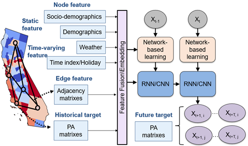

# Spatiotemporal Population Flow Forecasting via Temporal Fusion Graph Convolutional Neural Network: An comparison analysis



In this study, we aim to predict the daily county-level population flow time series extracted from LBS data across the contiguous US. 
We introduce a popular deep learning framework, Temporal Fusion Graph Convolutional Neural Network (TFGCN), for multivariable and multi-horizon population flow time series forecasting.
The main scopes of our study include two parts:
* First, to extensively compare the performance of different cutting-edge TFGCN models in predicting population flow time-series. 
* Second, to analyze the effects of  adjacency matrices on model performance and determine the best that can describe the spatial structure of the nationwide population flow. 

## Environment
We use the torch >= 1.10.2 and Python 3 for implementation.

We follow the framework of [pytorch_geometric_temporal](https://github.com/SonghuaHu-UMD/pytorch_geometric_temporal) to prepare data and run the model.

Please execute the following command to get the source code:

```bash
git clone https://github.com/SonghuaHu-UMD/PA_Forecast_PGT
cd PA_Forecast_PGT
```

## Data Preparation
Unzip the `data.7z` and put it into the `data` folde, and then you can get:

* us_node_values_pre.npy: temporal node signal, i.e. daily population inflow across the US counties from SafeGraph.
* us_node_static_pre.npy: static node feature.
* us_adj_mat_dist_1_pre.npy: adjacency matrix measured by distance.
* us_adj_mat_fb_pre.npy: adjacency matrix measured by Facebook social connection.
* us_adj_mat_gravity_pre.npy: adjacency matrix measured by gravity model.
* us_adj_mat_od_pre.npy: adjacency matrix measured by OD volume,

The folder `data_prepare` contains the codes for data processing.

## Model Training
The script `1.2-Model_multime.py` is used for training and evaluating the main model. 
After getting all the data prepared, run this script and you will get:

* Trained models saved at `checkpoint`.
* Results saved at `Results`.

The script `1.3-Model_Best_Result_Output.py` is used to transform the best prediction to original scale.

## Results
#### Model performance across different models

#### Model performance across different adjacency matrices

#### Top and last three counties' forecasting results

